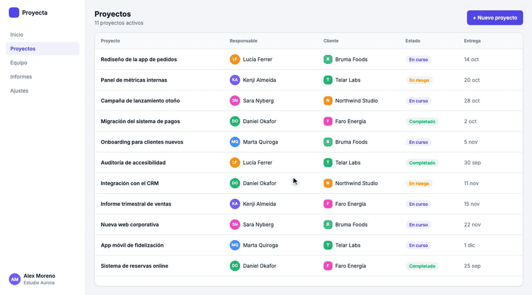

# Product Video Demo Kit

**De tu diseño en Figma a vídeos demo animados de tu producto, guiado paso a paso por Claude.**



Este kit convierte las pantallas de tu producto en Figma en vídeos demo: el cursor se mueve, los formularios se rellenan, los menús se abren, y todo se ve exactamente como tu producto, con datos ficticios. Los vídeos se dibujan con código ([Remotion](https://www.remotion.dev/)), así que salen nítidos, se corrigen al detalle y se pueden rehacer con otros datos en minutos.

**Por qué construir y no grabar.** Una grabación de pantalla solo deja recortar y hacer zoom sobre el producto tal como es. Aquí cada pantalla se construye con componentes que reproducen los tuyos, así que el producto se vuelve material: puedes quitar lo que distrae, hacer crecer una tarjeta justo cuando la voz habla de ella, juntar en un mismo encuadre dos piezas que en tu producto están en pantallas distintas, o unir varias escenas con un mismo personaje. Por ejemplo, una tarjeta de filtros que crece y suma el chat del asistente en el momento exacto en que la voz dice "pregúntaselo al asistente", y se ve la petición y su efecto a la vez. Sigue siendo fiel, porque cada pieza es tu componente real; lo que se inventa es la composición, no el aspecto.

**No hace falta saber programar.** Hablas con Claude Code en lenguaje normal y él hace la parte técnica siguiendo unas fases definidas: conecta con tu Figma, descarga las pantallas, te enseña los flujos de tu producto, saca los colores y la tipografía, construye las escenas, escribe el guion y renderiza el vídeo. Tú decides qué contar y das el visto bueno.

## Qué vas a tener al final

- **Una galería de tu producto**: todas tus pantallas de Figma en una página, agrupadas por flujos, con tu sistema visual (colores, tipografía, radios, espaciados).
- **El mapa de flujos**: qué tareas se hacen en tu producto, con qué pantallas y en qué orden.
- **Tu sistema visual documentado**: design tokens y patrones de interacción, con la fuente de cada valor.
- **Vídeos demo en MP4**, listos para tu web, redes o presentaciones, y la capacidad de hacer más.

## Qué necesitas

- Un ordenador con **Mac, Windows o Linux**.
- **[Claude Code](https://claude.com/claude-code)**, en la app de escritorio, la terminal o tu editor. Necesita una suscripción de Claude que lo incluya (Pro o superior) o una cuenta de la API de Anthropic.
- Una **cuenta de Figma** con acceso al archivo de diseño de tu producto.
- Unas horas repartidas en varias sesiones. Puedes parar cuando quieras: el progreso se guarda.

Node.js y Python también hacen falta, pero no te preocupes: Claude comprueba si los tienes y te explica cómo instalarlos.

## Cómo empezar

1. **Descarga el kit.** Arriba en esta página, botón verde **Code → Download ZIP**, y descomprímelo donde quieras (por ejemplo, en Documentos).
   *Si usas GitHub: **Use this template → Create a new repository** y márcalo como **Private**, porque tu copia va a contener el diseño de tu producto.*
2. **Abre la carpeta en Claude Code.** En la app de escritorio, elige la carpeta del kit como proyecto. En la terminal, entra en la carpeta y escribe `claude`.
3. **Escribe `/empezar`.** Claude se presenta, comprueba tu ordenador y te guía desde ahí.

En Mac también puedes hacer doble clic en `instalar.command` para instalar las dependencias antes de empezar (la primera vez, clic derecho → Abrir).

## Las fases

| | Fase | Qué pasa | Tu parte |
|---|---|---|---|
| 0 | Instalación | Claude revisa tu ordenador, instala Remotion y renderiza un vídeo de prueba | Instalar lo que falte, si falta algo |
| 1 | Conectar Figma | Claude se conecta a tu archivo de Figma (solo lectura) | Crear un token en Figma e iniciar sesión |
| 2 | Inventario | Lista de todas las pantallas del archivo | Elegir qué páginas entran |
| 3 | Descarga | Todas las pantallas descargadas y una galería para verlas | Esperar |
| 4 | Mapa de flujos | Claude propone los flujos de tu producto | Corregir y elegir cuáles enseñar |
| 5 | Sistema visual | Colores, tipografía, iconos y patrones de tu producto | Confirmar que lo reconoces |
| 6 | Escenas | Cada pantalla se convierte en una escena animable | Revisar cada una junto a su diseño |
| 7 | Guion | El vídeo escena a escena, primero en palabras | Decir qué quieres contar y aprobarlo |
| 8 | Render y revisión | El vídeo renderizado y corregido ronda a ronda | Verlo y decir qué cambiar |
| 9 | Entrega | El vídeo aprobado, guardado y optimizado | Aprobarlo |

Cada fase tiene su archivo en [`fases/`](fases/) por si quieres ver el detalle. Comandos útiles dentro de Claude Code:

- `/empezar`: empieza o retoma por donde lo dejaste.
- `/estado`: en qué punto está el proyecto.
- `/galeria`: abre la galería de tu producto.
- `/nuevo-video` *qué quieres enseñar*: prepara un vídeo nuevo.
- `/feedback` *tus cambios*: aplica una ronda de correcciones a un vídeo.

## Lo que hace que los vídeos salgan bien

El kit incluye [`docs/reglas-de-video.md`](docs/reglas-de-video.md): 24 reglas que salieron de corregir vídeos demo reales, ronda a ronda. Por ejemplo: las esperas no se copian del producto real, lo que se escribe se ve escribirse, el cursor continúa entre escenas, detrás de un modal se ve la pantalla real atenuada y las tablas se llenan de filas. Claude las aplica desde el primer borrador y añade las tuyas cuando corriges algo, así que cada vídeo sale mejor que el anterior.

## Preguntas frecuentes

**¿Mi diseño se sube a algún sitio?**
No. Todo se queda en tu ordenador. El kit solo lee de Figma (nunca modifica tu archivo) y Claude tiene instrucciones de no subir ni publicar nada sin que se lo pidas. El token de Figma se guarda en un archivo local (`.env`) que Claude no puede leer.

**¿Cuánto cuesta?**
El kit es gratuito y de código abierto. Necesitas tu suscripción de Claude y tu cuenta de Figma. Si en algún momento algo costara dinero (por ejemplo, generar fotos con IA), Claude te pregunta antes.

**¿Y si mi producto no está entero en Figma?**
Las pantallas o piezas que no estén diseñadas se construyen a partir de capturas del producto real (fase 6), y una grabación de pantalla ayuda a entender cómo se comportan.

**¿Funciona con cualquier producto?**
Con cualquier producto con interfaz: webs, apps de escritorio, paneles de gestión. Las apps móviles también funcionan cambiando el tamaño del vídeo.

**¿Puedo sacar vídeos en vertical para redes?**
Sí. Se construye una vez y se reencuadra para 9:16 o 1:1 (fase 8).

## Qué hay dentro

```
fases/        Las instrucciones de cada fase
tools/        Herramientas que usa Claude (descarga de Figma, render, validación, galería)
docs/         Reglas de vídeo, design tokens, patrones, datos ficticios, glosario, problemas
referencia/   Lo que se sabe de tu producto (se llena durante el proceso)
renderer/     El motor de vídeo (Remotion), con un flujo de ejemplo
entregables/  Tus vídeos aprobados
PROGRESO.md   Por dónde vas
CLAUDE.md     Las instrucciones que sigue Claude
```

## Licencia

[MIT](LICENSE). Úsalo, modifícalo y compártelo libremente, también en proyectos comerciales, manteniendo el aviso de copyright.

Remotion tiene su propia licencia: es gratuita para particulares y empresas pequeñas, pero algunas empresas necesitan una licencia de empresa. Consulta [remotion.dev/license](https://www.remotion.dev/license) antes de usarlo en una empresa.
